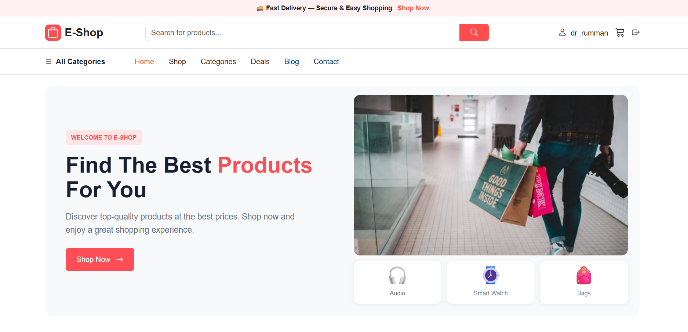
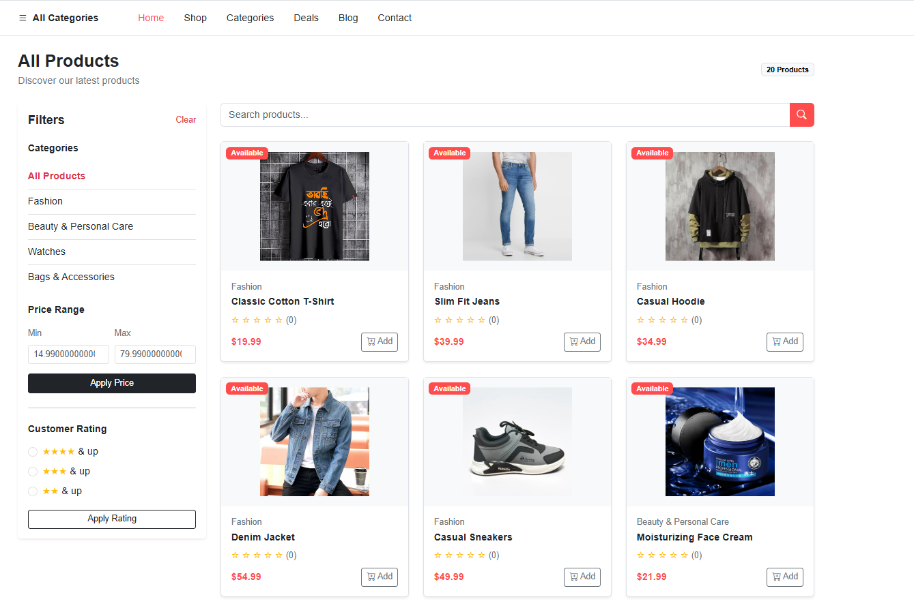
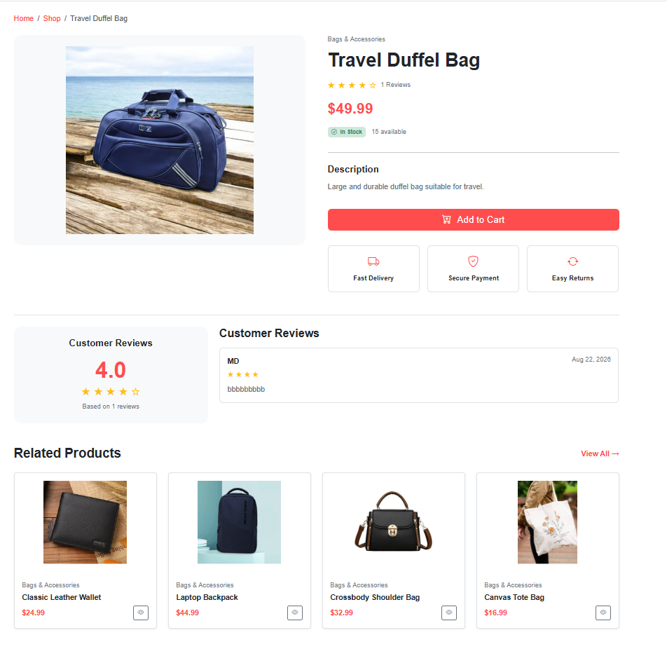
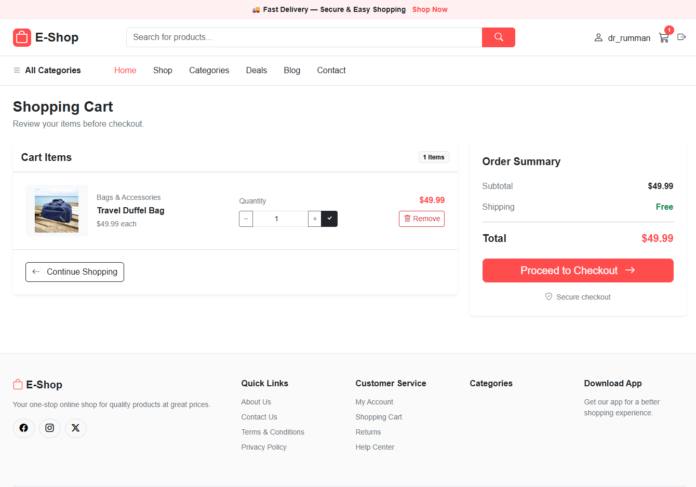
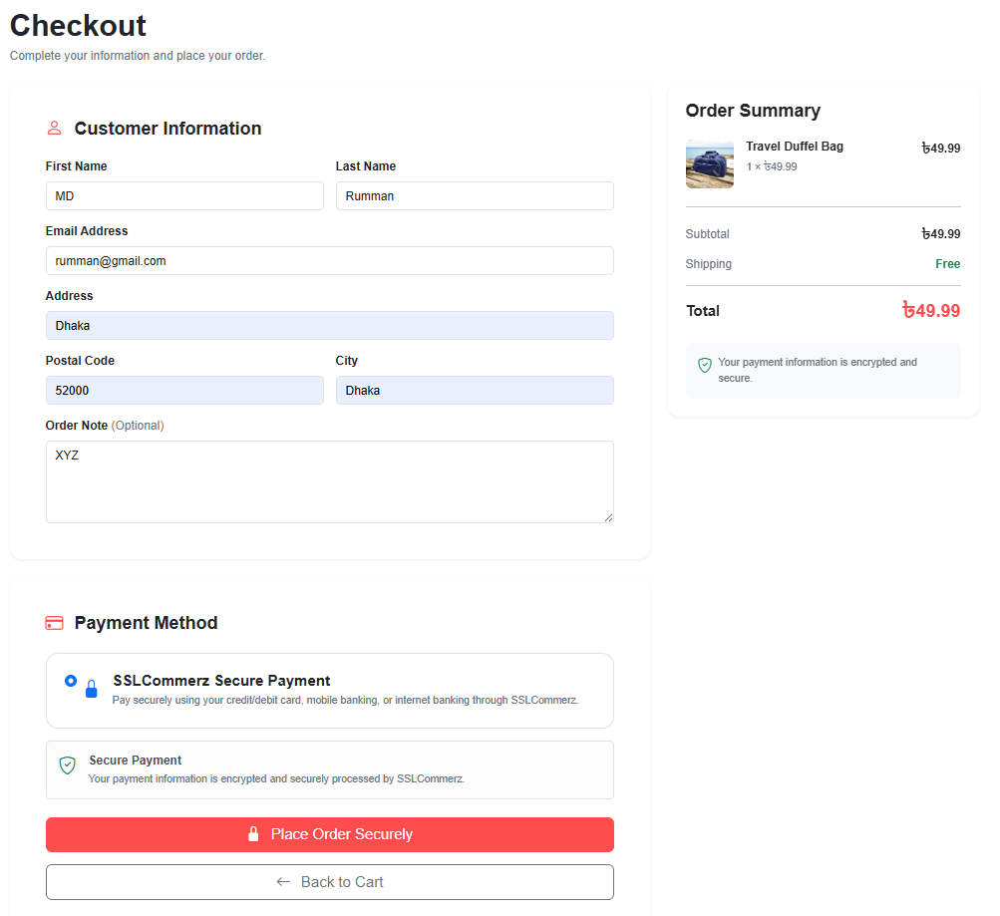
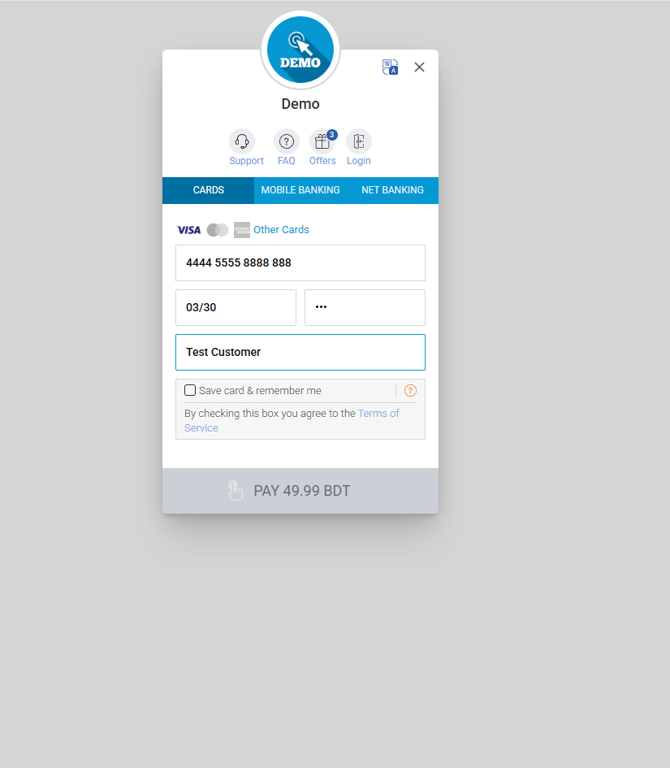
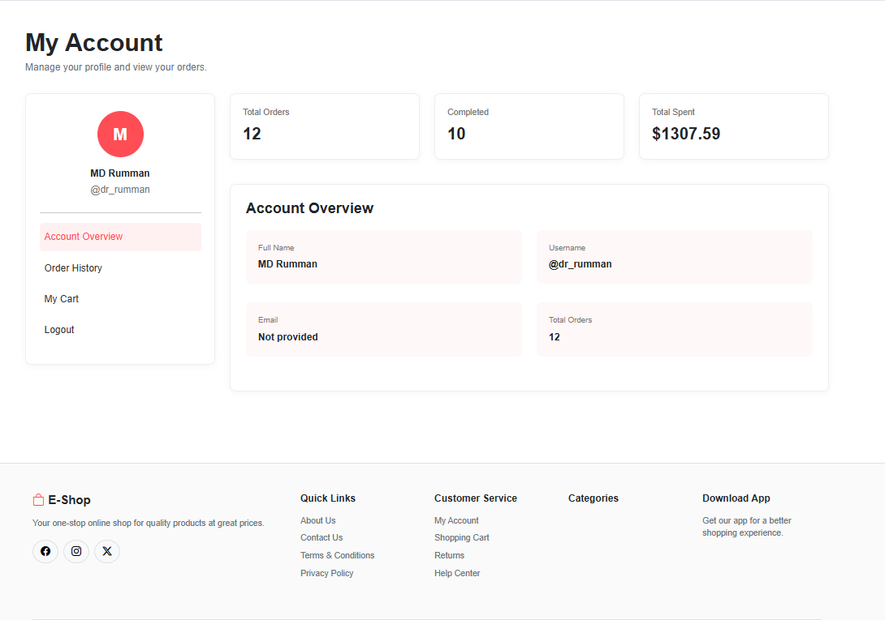
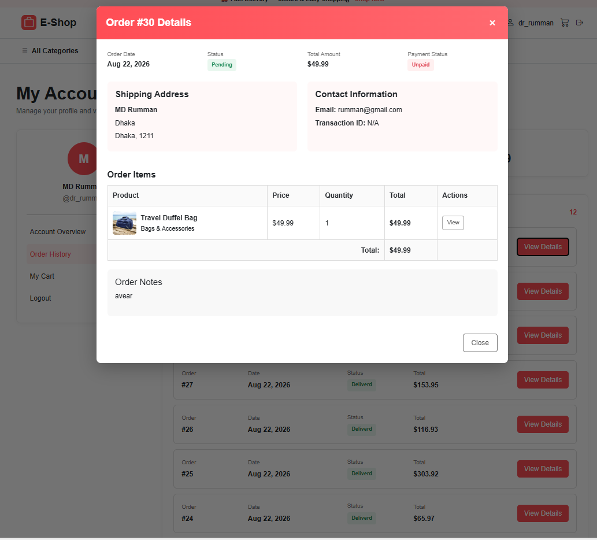
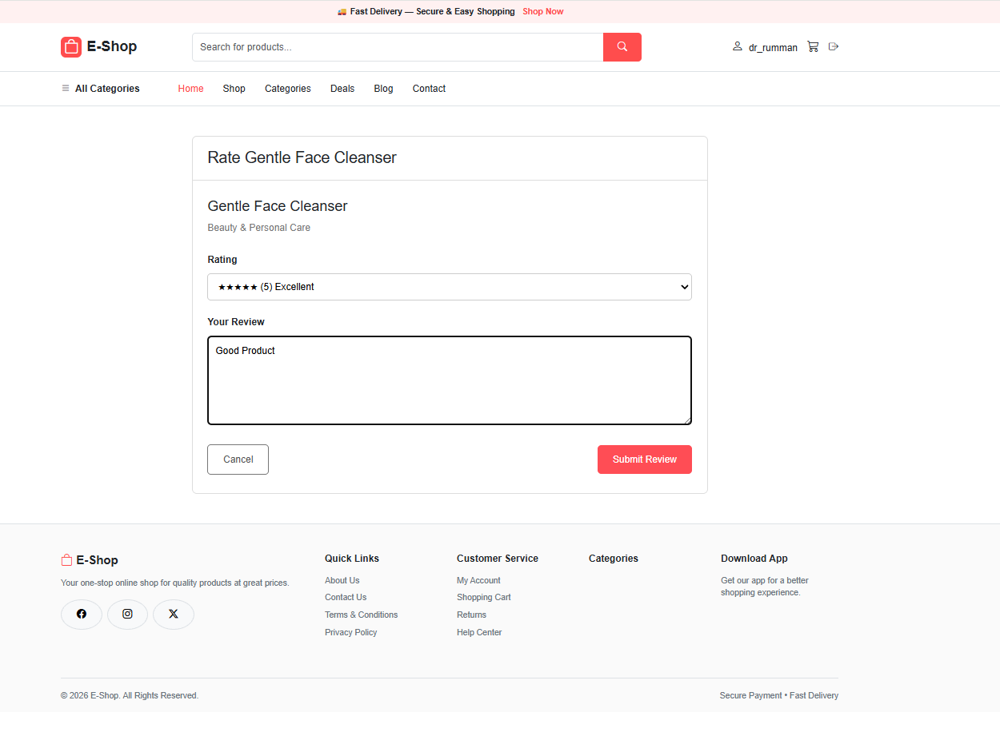

# E-Shop

A full-stack e-commerce web application built with Django.  
Users can browse products, search and filter products, manage their shopping cart, place orders, make payments through SSLCommerz, write product reviews, and manage their account and order history.

---

## Project Overview

E-Shop is an online shopping platform developed using Django.

The project provides a complete e-commerce workflow starting from product browsing and authentication to cart management, checkout, online payment, order management, email confirmation, and product reviews.

The application also includes Google authentication, Django admin management, stock management, and a responsive Bootstrap-based user interface.

---

## Features

### Authentication

- User Registration
- User Login
- User Logout
- Google Login using Django Allauth
- Login protection for authenticated features
- User profile and account management

### Product Management

- Product listing
- Product details page
- Category-based product filtering
- Product search
- Product stock management
- Product price display
- Product rating and review system
- Average product rating display

### Shopping Cart

- Add product to cart
- Update product quantity
- Remove product from cart
- Cart item count in navbar
- Cart total calculation
- Login required for cart operations
- Empty cart handling

### Checkout

- Checkout form
- Customer information
- Shipping address
- City and postal code
- Order note
- Order creation
- Order item creation
- Automatic cart clearing after order creation

### Payment System

- SSLCommerz payment gateway integration
- Sandbox payment support
- Payment success handling
- Payment failed handling
- Payment cancellation handling
- Transaction ID storage
- Paid/unpaid order status
- Automatic stock reduction after successful payment

### Order Management

- Order history
- Order details
- Recent orders
- Order status
- Payment status
- Transaction ID
- Order total calculation
- Order creation date
- Order status tracking

Order statuses include:

```text
Pending
Processing
Shipped
Deliverd
Canceled
````

### Product Rating & Review

* Users can rate purchased products
* 1–5 star rating system
* Product review submission
* Review editing
* Average product rating
* Rating count
* Users cannot rate products they have not purchased

### Email System

* Order confirmation email
* HTML email template
* Customer order information in email
* Gmail SMTP configuration

### User Profile

* Account overview
* Username display
* User information
* Recent orders
* Order details
* Product review management

### Admin

* Django admin panel
* Product management
* Category management
* Order management
* User management
* Rating management

### Responsive Design

* Responsive homepage
* Responsive product cards
* Responsive navigation
* Responsive checkout page
* Responsive account pages
* Mobile-friendly layout
* Bootstrap 5 based UI

---

## Technologies Used

* Python
* Django 5.2
* SQLite3
* HTML5
* CSS3
* Bootstrap 5
* Bootstrap Icons
* JavaScript
* Django Allauth
* Google Authentication
* SSLCommerz Payment Gateway
* Gmail SMTP

---

## Main Django Packages

The project uses Django and several additional packages for authentication and payment functionality.

Main packages include:

```text
Django
django-allauth
requests
```

The complete dependency list is available in:

```text
requirements.txt
```

---

## Project Structure

```text
e_shop/
│
├── shop/
│   ├── migrations/
│   ├── __init__.py
│   ├── admin.py
│   ├── apps.py
│   ├── context_processors.py
│   ├── forms.py
│   ├── models.py
│   ├── tests.py
│   ├── urls.py
│   ├── utils.py
│   └── views.py
│
├── e_shop/
│   ├── __init__.py
│   ├── settings.py
│   ├── urls.py
│   ├── asgi.py
│   └── wsgi.py
│
├── media/
│
│
├── static/
│   └── images/
│    
│
├── templates/
│   ├── shop/
│   │   ├── email/
│   │   │   └── order_confirmation.html
│   │   │
│   │   ├── cart.html
│   │   ├── checkout.html
│   │   ├── home.html
│   │   ├── login.html
│   │   ├── payment_cancel.html
│   │   ├── payment_fail.html
│   │   ├── payment_success.html
│   │   ├── product_detail.html
│   │   ├── product_list.html
│   │   ├── profile.html
│   │   ├── rate_product.html
│   │   └── register.html
│   │
│   └── base.html
│
├── screenshots/
│   ├── home_page.png
│   ├── product_list.png
│   ├── product_details.png
│   ├── cart.png
│   ├── checkout.png
│   ├── payment.png
│   ├── account_overview.png
│   ├── order_details.png
│   └── product_rating.png
│
├── .gitignore
├── db.sqlite3
├── manage.py
├── README.md
└── requirements.txt
```

---

## Main Models

### Category

Stores product categories.

Main fields include:

* Name
* Slug
* Description

---

### Product

Stores product information.

Main fields include:

* Category
* Name
* Slug
* Description
* Price
* Stock
* Image
* Created date

---

### Cart

Stores the shopping cart for each user.

The cart contains multiple cart items.

---

### CartItem

Stores individual products inside a user's cart.

Main information includes:

* Cart
* Product
* Quantity

---

### Order

Stores customer order information.

Main fields include:

* User
* First name
* Last name
* Email
* Address
* Postal code
* City
* Status
* Note
* Paid status
* Transaction ID
* Created date
* Updated date

Order status:

```text
pending
processing
shipped
deliverd
canceled
```

---

### OrderItem

Stores products belonging to an order.

Main information includes:

* Order
* Product
* Price
* Quantity

---

### Rating

Stores product ratings and reviews.

Main information includes:

* Product
* User
* Rating
* Review

Users can only review products they have purchased.

---

## Main Workflow

### Shopping Flow

```text
Home Page
↓
Browse Products
↓
Product Details
↓
Add to Cart
↓
Cart
↓
Checkout
↓
Create Order
↓
SSLCommerz Payment
↓
Payment Success
↓
Order Processing
↓
Profile / Order History
```

---

### Authentication Flow

```text
Register
↓
Login
↓
Browse Products
↓
Add to Cart
↓
Checkout
```

Google authentication is handled using Django Allauth.

---

### Payment Flow

```text
Checkout
↓
Create Order
↓
Store Order ID in Session
↓
Payment Process
↓
SSLCommerz
↓
Payment Success
↓
Order marked as Paid
↓
Order Status = Processing
↓
Product Stock Reduced
↓
Confirmation Email Sent
↓
Profile
```

---

### Product Rating Flow

```text
Order Product
↓
Payment Successful
↓
Order Paid
↓
Product Delivered
↓
Rate Product
↓
Submit Rating & Review
↓
Review Appears on Product Details
```

---

## Installation

### 1. Clone the Repository

```bash
git clone https://github.com/your-username/e-shop.git
cd e-shop
```

---

### 2. Create Virtual Environment

```bash
python -m venv venv
```

---

### 3. Activate Virtual Environment

#### Windows PowerShell

```powershell
venv\Scripts\activate
```

#### Linux / macOS

```bash
source venv/bin/activate
```

---

### 4. Install Dependencies

```bash
pip install -r requirements.txt
```

---

### 5. Run Migrations

```bash
python manage.py makemigrations
python manage.py migrate
```

---

### 6. Create Superuser

```bash
python manage.py createsuperuser
```

---

### 7. Run Development Server

```bash
python manage.py runserver
```

Open the project in your browser:

```text
http://127.0.0.1:8000/
```

---

## Environment Configuration

For development, sensitive credentials such as payment gateway credentials, email credentials, and Django secret key should be stored securely.

The `.env` file should never be pushed to GitHub.

---

## Google Login Setup

The project uses Django Allauth for Google authentication.

Required applications:

```text
allauth
allauth.account
allauth.socialaccount
allauth.socialaccount.providers.google
```

Google authentication requires a Google OAuth application.

The Google Client ID and Client Secret should be configured securely.

---

## SSLCommerz Setup

The project uses SSLCommerz Sandbox for testing online payments.

Sandbox payment URL:

```text
https://sandbox.sslcommerz.com/gwprocess/v4/api.php
```

Required credentials:

```text
SSLCOMMERZ_STORE_ID
SSLCOMMERZ_STORE_PASSWORD
```

Payment callbacks are handled through:

```text
Payment Success
Payment Failed
Payment Cancel
```

---

## Email Configuration

The project uses Gmail SMTP for sending order confirmation emails.

Example configuration:

```python
EMAIL_BACKEND = 'django.core.mail.backends.smtp.EmailBackend'
EMAIL_HOST = 'smtp.gmail.com'
EMAIL_PORT = 587
EMAIL_USE_TLS = True
```

Gmail App Password should be used instead of the normal Gmail password.

---

## URL Routes

Main application routes include:

| Page            | Purpose                       |
| --------------- | ----------------------------- |
| Home            | Homepage                      |
| Product List    | Browse products               |
| Product Detail  | View product information      |
| Cart            | Shopping cart                 |
| Checkout        | Create order                  |
| Payment Process | Start SSLCommerz payment      |
| Payment Success | Handle successful payment     |
| Payment Fail    | Handle failed payment         |
| Payment Cancel  | Handle cancelled payment      |
| Profile         | User account                  |
| Order Detail    | View order information        |
| Rate Product    | Submit or edit product review |

---

## Screenshots

Create a folder named `screenshots` in the project root and add screenshots of the main pages.

### Home Page



### Product List



### Product Details



### Shopping Cart



### Checkout



### SSLCommerz Payment



### Account Overview



### Order Details



### Product Rating



---

## Demo Data

For development and testing purposes, demo orders and product ratings can be generated using Django Shell.

Start Django Shell:

```bash
python manage.py shell
```

Demo data can then be created for testing:

* Orders
* Order items
* Paid orders
* Product ratings
* Product reviews

---

## Important Notes

* SQLite3 is used as the default database for development.
* SSLCommerz is configured with Sandbox credentials for testing.
* Gmail App Password is required for SMTP email authentication.
* Google OAuth credentials should be kept private.
* Secret keys and passwords should not be committed to GitHub.
* The `media/` directory contains uploaded product images.
* Product stock is reduced after successful payment.
* Only users who purchased a product can submit a rating.
* Users can edit their existing product reviews.
* The application uses Bootstrap 5 for responsive UI.

---

## .gitignore

Use the following `.gitignore`:

```gitignore
# Python
__pycache__/
*.py[cod]
*.pyo
*.pyd

# Virtual Environment
venv/
.venv/
env/

# Django Database
db.sqlite3
*.sqlite3
*.sqlite3-journal

# Environment Variables
.env
*.env

# Media
media/

# Static Files
staticfiles/

# IDE
.vscode/
.idea/

# Logs
*.log
```

---

## Author

Developed by Md Fahim Shahriar